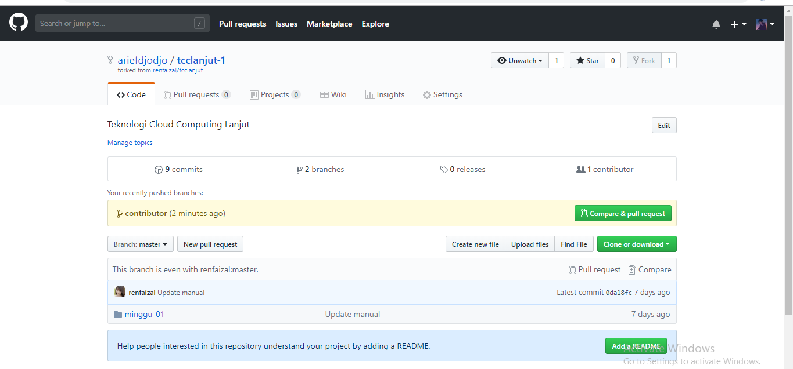

# MINGGU 02

## MEMBUAT DAN MENGINTEGRASIKAN PULL REQUEST (PR)

## FORK
1. 	Setelah login,kita akses repo yang akan kita fork. [https://github.com/renfaizal/tcclanjut](https://github.com/renfaizal/tcclanjut)
	
2. 	Selanjutnya akan ada repositori pada User saya dengan nama tcclanjut-1 yang berasal dari fork yang kita lakukan ebelumnya.
	
3. 	Selanjutnya kita clone pada direktori local kita. dengan cara 
	git clone https://github.com/ariefdjodjo/tcclanjut-1
	
4. 	hasilnya kita telah menghasilkan sebuah directori clone cengan nama tcclanjut-1. 
	
5. 	kita buat remote repo upstream 
	

## Mengirimkan Pull Request
Secara umum, langkah-langkah yang kita lakukan adalah:

## * Kontributor akan bekerja di repo lokal (create, update, delete isi)
1. 	pastikan bahwa repo lokal telah kita singkronkan dengan repo dari *upsteam author*. dengan cara ketik ```bash git fetch upstream bash```
	
	pada gambar diatas kita memiliki 2 branch yaitu master dan contributor.
2. 	lakukan update perubahan pada local repo kita. dapat kita lihat struktur repo sebagai berikut.
	
3.  kita tambahkan sebuah file kolaborasi.md pada project repo local kita.
	
4.  Masuk ke branch contributor dengan perintah ```bash git checkout -b contributor bash```
	
5.  kita lihat status git pada state. ```bash git status ```bash. hasilnya ada file baru yang kita buat tadi yang siap untuk di commit. 
	
6. 	kita lakukan commit terhadap perubahan local kita
	
7.	kita pindah ke branch master kembali. 
	
	ketika kita kembali ke branch master, local file kita juga akan di update sesuai dengan branch master.
	
8.	selanjutnya kita push origin contributor ke branch master.
	
9. 	kita buka halaman [https://github.com/ariefdjodjo/tcclanjut-1](https://github.com/ariefdjodjo/tcclanjut-1). Pada halaman tersebut akan ditampilkan isi yang kita push.
	
10.	Pilih ```Compare and pull request```, kemudian isikan deskripsi PR 
	
	klik pada ```Create pull request```:
	
11.	pada halaman [https://github.com/renfaizal/tcclanjut](https://github.com/renfaizal/tcclanjut) akan ada angka 1 pada pull request yang berarti telah ada pull request sebanyak 1
	
12. kontriibutor akan melakukan review dan dapat menyetujui atau menolak update pull request yang kita buat. 
	


## by Arief Gunawan 

