# MINGGU 03

# A. DEPLOYING FIRST CONTAINER
    [https://www.katacoda.com/courses/docker/deploying-first-container](https://www.katacoda.com/courses/docker/deploying-first-container)
1. Mencari images redis dari docker hub dengan perintah ``docker search redis``
    Selanjutnya, dengan docker CLI kita jalankan perintah untuk menjalankan image pada container kita. dengan perintau ```docker run <nama image>```. Kita coba dengan menjalankan perintah ``docker run redis`` yang artinya kita akan menjalankan images redis pada kontainer kita 

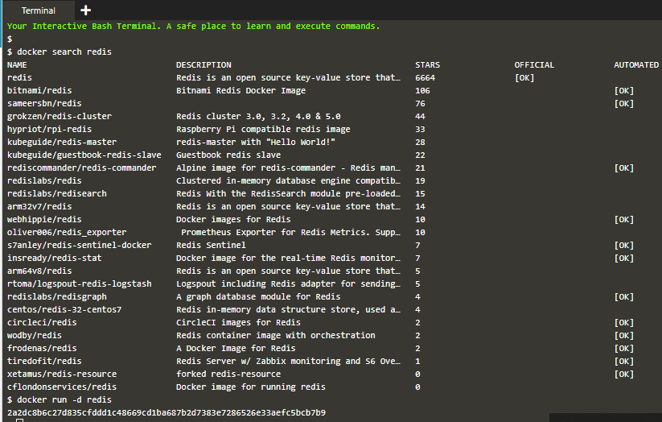

2. Untuk melihat images apa saja yang berjalan pada container kita, kita dapat cek dengan perintah ``docker ps``

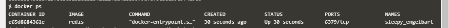

Kita juga dapat melihat detail dari image tersebut dengan perintah ```docker inspect <nama_images | id_images>``

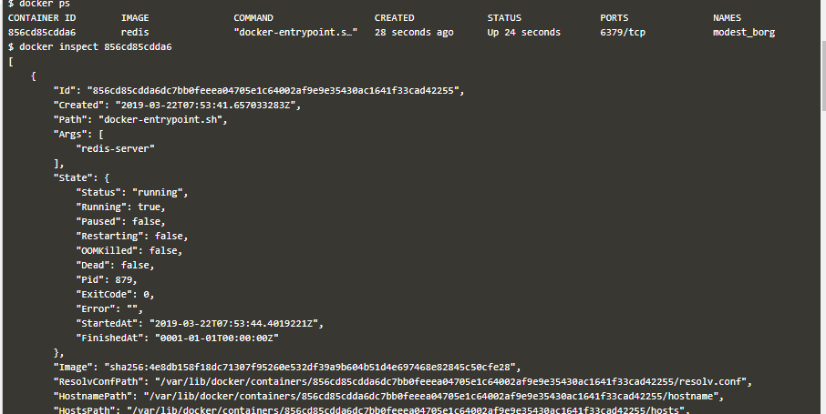

3. Dengan perintah ``docker run <images>``, images tersebut belum dapat berjalan karena kita perlu ekspose Port melalui host. setelah terbuka kita dapat ekspos image tersebut melalui client ataupun host itu sendiri. perintahnya adalah ``-p <host-port>:<container-port>`` 

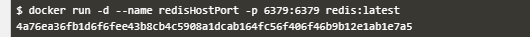

4. Kita juga dapat meng-exspose image menggunakan port yang berbeda. atau menjalankan beberapa intace dengan satu images. 

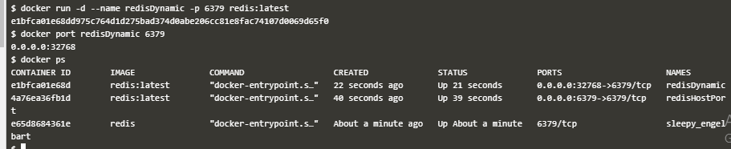


# B. CREATE NGINX STATIC WEB SERVER 
[https://www.katacoda.com/courses/docker/create-nginx-static-web-server](https://www.katacoda.com/courses/docker/create-nginx-static-web-server)

1. Pertama-tama kita buat dockerfile. Dockerfile adalah daftar instruksi yang menjelaskan cara menggunakan aplikasi Anda. Dalam contoh ini, image dasar yang akan digunakan adalah versi Alpine dari Nginx. Image ini menyediakan web server yang dikonfigurasi pada distribusi Linux Alpine.

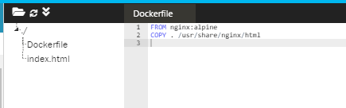

Pada baris pertama artinya kita akan menjalankan (run) image nginx dari alpbine. selanjutnya akan di copy file dari docker ke direktori container image di direktori /usr/share/nginx/html

2. Untuk menjalankan docker file kita menggunakan perintah ``build`` pada docker CLI.  Formatnya adalah ``docker build -t <build-directory>``. 

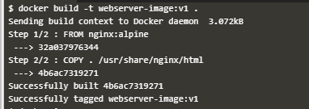

pada perintah diatas kita menjalankan dockerfile dimana image yang dibangun memiliki nama ``webserver-image`` dengan tag ``v1``. Dapat kita lihat hasilya dengan perintah ``docker images``.

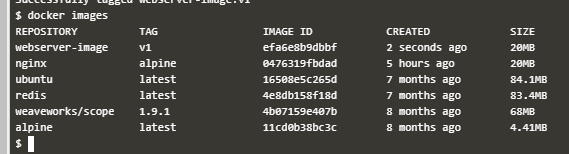

3. Image-image yang berjalan dapat kita jalankan ke host dengan memberikan izin akses pada port jaringan tertentu. caranya dengan menggunakan perintah ``docker run``

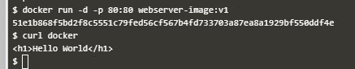

pada perintah diataskita jalankan image ``webserver-image`` yang menggunakan port 80 di beri akses ke host dengan port 80 juga ``-p 80:80``. Untuk mengecek apakah web server berjalan dengan perintah ``curl docker``

4. kita juga dapat cek dengan membuka browser dan meng akses docker server kita

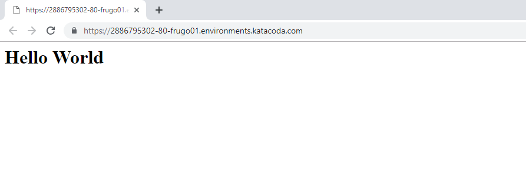


# C. DOCKER 2
[https://www.katacoda.com/courses/docker/2](https://www.katacoda.com/courses/docker/2)

1. Base Images, Copy, Expose dan menjalankan image
Semua image di docker bermula dari Base Image. Base image adalah image yang sama dari docker regirtri yang digunakan untuk menjalankan Container. pada bagian ini kita akan menggunakan base image nginx versi 1.11-alpine sehingga pada dockerfile kita tambahkan tag ``FROM nginx: 1.11-alpine``.
selanjutnya kita Copy base file kita pada direktori container image dimana kita akan men-copy file ``index.php`` pada direktori ``/usr/share/nginx/html``.

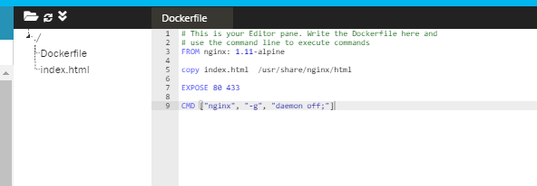

2. Jalankan dockerfile dengan perintah ``docker build <nama_image>:<tag> .``.

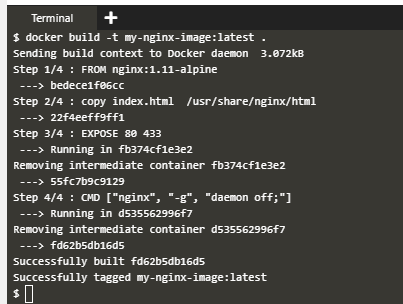

hasilnya dapat kita lihat sebagai berikut

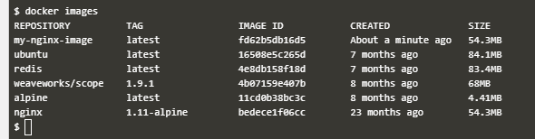

3. Kita jalankan image kita agar dapat diakses oleh host dengan cara ``docker run -d -p 80:80 <image-id|friendly-tag-name>``. 

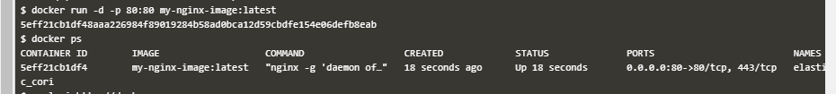

selanjutnya kita cek dengan perinta ``docker ps``

4. Kita dapat mengakses webserver yang dibuat docker melalui host dengan perintah ``curl -i http://docker`` akan mengembalikan file indeks kita melalui NGINX dan image yang kita buat.

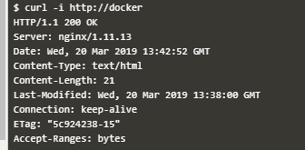


## by. Arief Gunawan