### MINGGU KE-04

Dalam berbagaikasus kita dapat menggunakan dua atau lebih container pada satu Server Docket. Container-container tersebut nantinya akan dapat terhubung dengan menggunakan Docker Media komunikasi yaitu Network atau menggunakan Link. Pada kesematan ini kita akan sedikit mempraktekan penggunaan Link dan Network pada docker dengan playgroud Katakoda.

## A. KONEKSI ANTARA 2 NODE MENGGUNAKAN NETWORK
"Communicating between containers".

1.  Kita Coba cek network yang tersedia dalam docker dengan perintah ``docker network ls``

    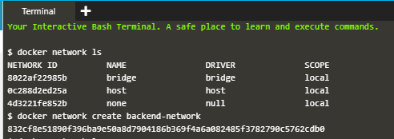

    Pada gambar diatas dapat kita lihat bahwa terdapat 3 (tiga) network pada docker yaitu bridge, host dan none. selanjutnya kita buat sebuah network lagi dengan perintah ``docker network create backend-network`` yang artinya kita akan membuat network pada docker dengan nama ``backend-network``, hasilnya dapat kita cek kembali dengan perintah ``docker network ls``

    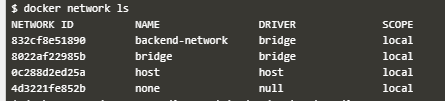

2.  Selanjutnya kita Connect ke Network saat menjalankan container baru, kita dapat menggunakan ``-net`` attribute untuk menandai network key harus dikoneksikan. Perintah yang digunakan adalah ``docker run -d --name=redis --net=backed-network redis`` artinya kita akan menjalankan redis pada network backen-network.
   
    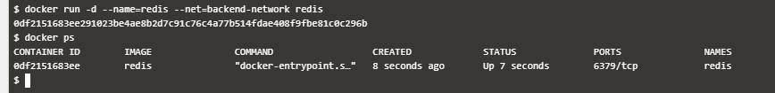

    Selanjutnya kita cek dengan perintah ``docker ps``. Dapat dilihat bahwa telah berjalan pada container image redis.

3.  Selanjutnya kita lihat enviroment variable pada container. Docker network berlaku seperti network tradisional dimana nodes dapat menempel ataupun terpisah. ``docker run --net=backend-network alpine env``

    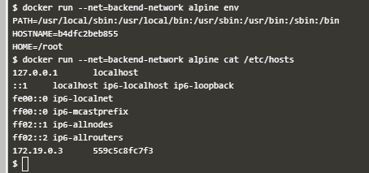

    Alpine adalah webservice yang akan berjalan pada server kita. dapat kita lihat bahwa PATH alpine terletak pada direktori apa? serta kita juga dapat mengetahui HOSTNAME dan direktori HOME.

    Selanjutnya kita jalankan ``docker run --net=backend-network alpine cat /etc/hosts`` untuk melihat jaringan host pada alpine.

4.  Selanjutnya kita cek IP DNS dari Alpine dengan perintah ``docker run --net=backend-network alpine cat /etc/resolf.conf``

    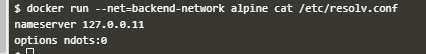

5.  kita coba lakukan ``ping`` ke jaringan alpine pada redis

    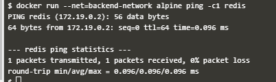

6.  Selanjutnya kita buat network baru seperti pada langkah pertama dengan nama ``fronted-network`` dengan perintah ``docker network create frontend-network``. hasilnya sebagai berikut:
   
    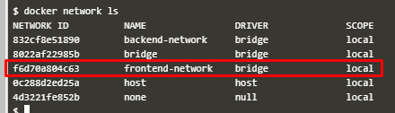

7.  Kemudian menghubungkan ``frontend-network`` dengan redis network ``docker network connect frontend-network redis``
    
    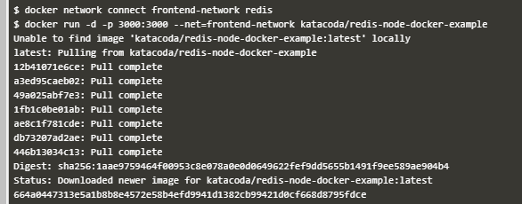

    selanjutnya jalankan web server dengan perintah ``docker run -d -p 3000:3000 --net=frontend-network katacoda/redis-node-docker-example``

8.  Selanjutnya kita coba koneksi apakah sudah dapat diakses atau belum dengan mengunakan ``curl`` dimana docker:3000. 3000 adalah port yang digunakan.
    
    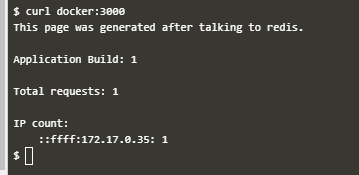

9.  Selanjutnya kita buat lagi network baru seperti pada langkah pertama dengan nama ``fronted-network2`` dengan perintah ``docker network create frontend-network2``. hasilnya sebagai berikut:
    
    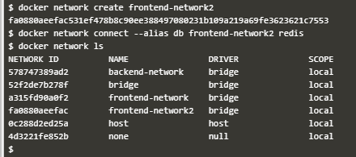

    Selanjutnya kita buat koneksi untuk ``db`` pada redis dengan perintah ``docker network connet --alias db frontend-network2 redis``

10. Coba lakukan ping pada container untuk akses sebuah service melalui db.
    
    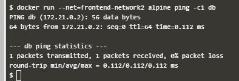

11. Untuk melihat network yang ada kita dapat menggunakan perintah ``docker network ls``. disitu kita dapat melihat ID hingga name dari network. jika kita ingi mengexplore network untuk melihat container dan ip addres yang digunakan, kita ketikkan perintah ``docker network inspect frontend-network``. ``frontend-network`` adalah nama dari network yang akan di inspect
    
    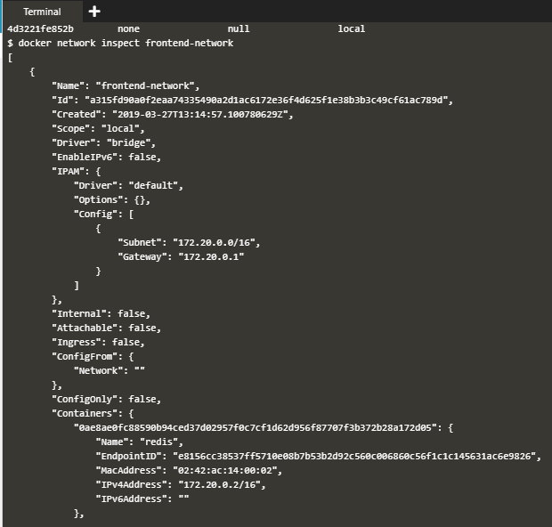

12. Untuk mematikan/disconect sebuah network, kita gunakan perintah ``docker network disconect frontend-network redis``.
    
    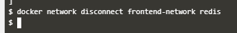

## B. KONEKSI ANTARA 2 NODE MENGGUNAKAN LINK
1. Pertama-tama kita harus memiliki sebuah container yang dalam hal ini kita menggunakan db redis. Perintah menjalankan container tersebut adalah ``docker run -d --name redis-server redis``. Untuk nama container adalah ``redis-server``. sehingga ketika kita cek dengan perintah ``docker ps`` dapat kita lihat bahwa names adalah ``redis-server``
   
   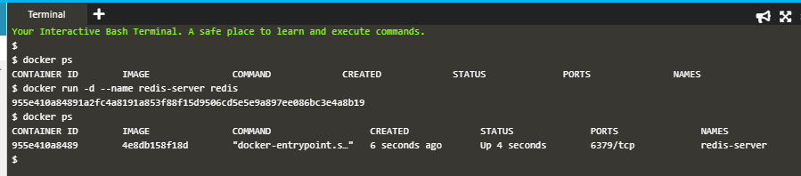

2. Selanjutnya untuk mengkoneksikan ke sebuah container maka kita gunakan ``--link <container-name|id>:<alias>`` ketika menlaunching sebuah container baru. Kali ini akan menghubungkan Alpine container yang dihubungan dengan redis-server yang telah dibuat tadi. Perintah untuk menghubunkan dua container tersebut adalah ``docker run --link redis-server:redis alpine env``.
   
   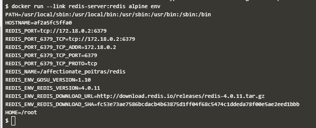

   dapat dilihat setting enveroment pada alpine dengan IP 172.18.0.2:6379

3. 
4. Melakukan Ping dengan perintah ``docker run --link redis-server:redis alpine ping -c 1 redis``
   
   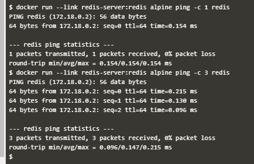

   nilai -c 1 adalah banyaknya tes koneksi yang di inginkan.

5. Selanjutnya kita hubungkan App pada jaringan dengan menggunaan link. kita hubungkan image dari katakoda dengan perintah sebagai berikut ``docker run -d -p 3000:3000 --link redis-server:redis katacoda/redis-node-docker-example`` yang artinya kita akan menjalankan App ``katacoda/redis-node-docker-example`` pada redis-server di PORT 3000.
   
   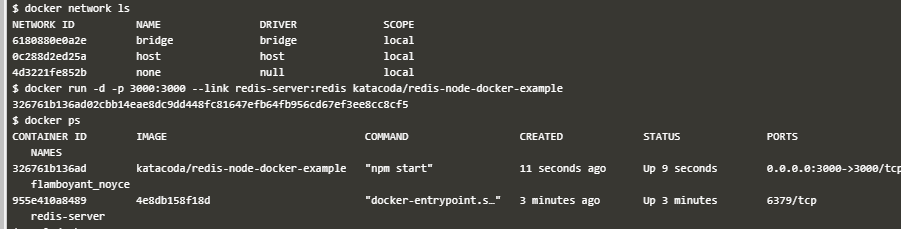

6. Kita coba koneksi dengan ``curl``
   
   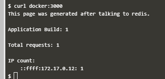

7. Selanjutnya kita hubungkan ke Redis CLI Perintah dengan perintah ``docker run -it --link redis-server:redis redis redis-cli -h redis`` akan menjalankan Redis-CLI tool dan terhubung dengan redis server melalui nama alias ``-it``
   
    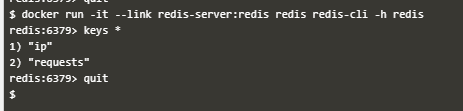

   Setelah muncul tampilan di atas ketikan perinta KEYS * makan akan ditampilkan contents stored terkini yang ada pada sumber redis container. untuk keluar dari Redis CLI dengan perintah ``quit``.

