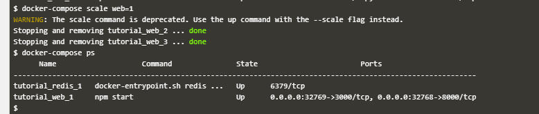
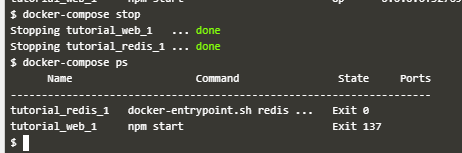

## Minggu ke-5

## Membuat Project dengan Docker Compose

Docker Compose adalah alat untuk mendefinisikan dan menjalankan aplikasi Docker multi-container. Dengan Docker Compose, kita dapat menggunakan file Compose untuk mengonfigurasi layanan aplikasi kita. Kemudian, menggunakan satu perintah untuk membuat dan memulai semua layanan dari konfigurasi kita. Dengan begitu kita akan lebih mudah dalam men-deploy aplikasi kita.

1. Langkah pertama kita buat sebuah file dengan nama ``docker-compose.yml``. Didalamnya kita isikan apa saja yang akan dijalankan/dibuat ketika file ini dijalankan.
   
   

   Pada gambar diatas kita akan membangun App berbasis Web dengan image dasar ``redis:alpine``. adapun port yang digunakan adalah port 3000 dan 8000. File ``docker-compose.yml`` diletakkan dalam directori project kita.
   
2. Setelah selesai membuat file ``docker-compose.yml``, selajutnya kita jalankan dengan perintah ``docker-compose up -d`` yang artinya akan dijalankan container pada background. 
   
   

   tunggu hingga proses build selesai. 

3. Selanjutnya kita cek container yang berjalan dengan perintah ``docker ps``. Dapat kita lihat bahwa terdapat 2 image yang berjalan yaitu  ``alpine:redis`` dan ``tutorial_web``
   
   

   

   untuk melihat log proses ``docker-compose`` dapat kita gunakan perintah ``docker-compose logs``

   

4. DOCKER SCALE
   Docker Scale digunakan untuk mengatur banyaknya kontainer yang berjalan untuk service App. Sehingga pada perintah ``docker-compose scale web=3`` berarti akan menjalankan container sebanyak 3.
   
   

   Dapat kita lihat dengan perintah ``docker-compose ps``

   jika kita jalankan perintah ``docker-compose scale web=1`` maka akan dihentikan service container ke 2 dan ke-3.

   

5. Untuk menghentikan seluruh service dari docker-compose kita dapat gunakan perintah ``docker-compose stop``.
   
   

6. Untuk menghapus docker compose kita gunakan perintah ``docker-compose rm``
   
   

## DOCKER SWARM

Swarm mode merupakan bagian dari command line interface Docker yang memudahkan pengguna untuk memanage komponen container apabila sudah familiar dengan command – command yang ada di Docker.

1. Untuk mengetahui commant yang mendukung docker swarm dapat kita ketikkan perintah ``docker swarm --help``
   
   

   dapat kita lihat bahwa kita dapat menggunakan perintah-perintah seperti init, join, leave dan update

2. Perintah ``docker swarm init`` digunakan untuk inisialisasi docker host menjadi multiple docker host. Dengan begitu docker engine dapat digunakan untuk clustering dan melakukan manage terhadap claster. 
   
   
   
   dapat kita lihat pada hasil diatas bahwa ada token yang digunakan untuk menambahkan node ke cluster.

3. Selanjutnya untuk melakukan connecting pada claster, kita dapat melakukan request token pada manager (docker swarm) dengan perintah token.
   
   

   pada perintah pertama kita meminta token dan menyimpannya pada variable ``$token`` untuk selanjutnya dilakukan perintah join ``docker swarm join <IP:Port> --token $token``

   jika berhasil akan muncul tulisan ``This node Join a Swarm as a worker``

    dapat kita cek dengan perintah ``docker node ls``.
