## A. HelloWord

Go adalah bahasa pemrograman baru yang dikembangkan di Google oleh Robert Griesemer, Rob Pike, dan Ken Thompson pada tahun 2007 dan mulai diperkenalkan di publik tahun 2009. Didalam go sudah terdapat Bahasa Pemrograman dan web service yang langsung dapat dijalankan. Golang menyediakan package ``net/http``, berisi berbagai macam fitur untuk keperluan pembuatan aplikasi berbasi web. Termasuk didalamnya routing, server, templating, dan lainnya, semua tinggal pakai.

Pada Bagian ini kita akan memulai mencoba mengenal GoWeb dengan ``net/http``. Perhatikan script dibawah ini:

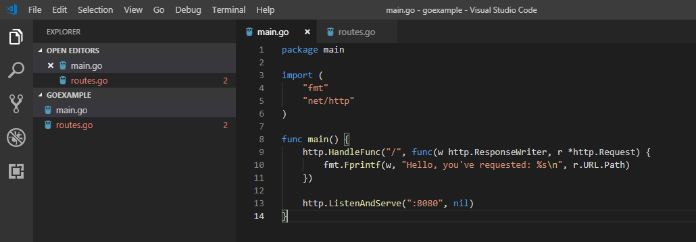

pertama-tama kita import dulu package ``ftm`` dan ``net/http``. Selanjutnya kita buat handler fungsi dengan ``http.HandleFunc()``. Fungsi ``http.HandleFunc()`` digunakan untuk routing aplikasi web. Maksud dari routing adalah penentuan aksi ketika url tertentu diakses oleh user. Yang dimaksud dengan ``"/"`` adalah dengan mengakses route "/" maka akan menampilkan halaman web dengan tulisan ``"Hello, you've requested: %s\n"``. 

Halaman web yang biasanya menggunakan port 80, pada script diatas dapat diakses pada port 8080 sehingga ketika kita jalankan pada browser dapat diakses pada ``http://localhost:8080``

Kita coba jalankan dengan perintah ``go run``

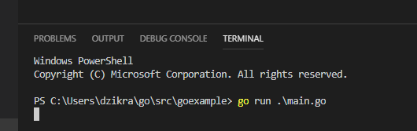

Selanjutnya kita buka dengan browser ``http://localhost:8080``. Hasilnya sebagai berikut.

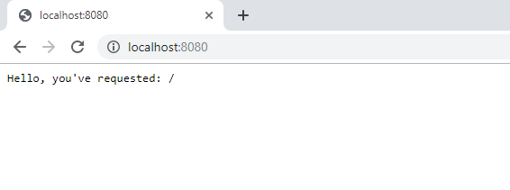

## ROUTING DENGAN GORILA/MUX

Package ``net/http`` di Go menyediakan banyak fungsi untuk protocol HTTP. Namun ada salah satu hal yang tidak dapat dilakukan dengan baik dimana dalam routing yang komplek dalam pengelompokan URL. Hal ini dapat diatasi dengan beberapa Package yang telah ada dan digunakan oleh komunitas GO. Salah satunya adalah ``Gorilla/Mux`` yang biasa digunakan untuk membuat route dengan parameter GET/POST. Untuk menggunakannya kita harus install package ``gorilla/mux`` terlebih dahulu dengan perintah ``go get -u github.com/gorilla/mux``. Artinya kita akan install package gorilla/mux dari akun github.com.

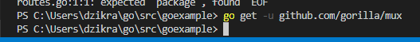

Setelah proses selesai, akan ada file download pada GOPATH kita dimana terdapat folder gitHub.com. sebagai berikut:

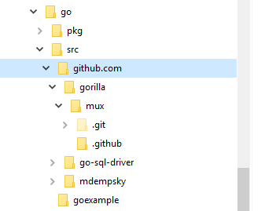

Contoh Script:

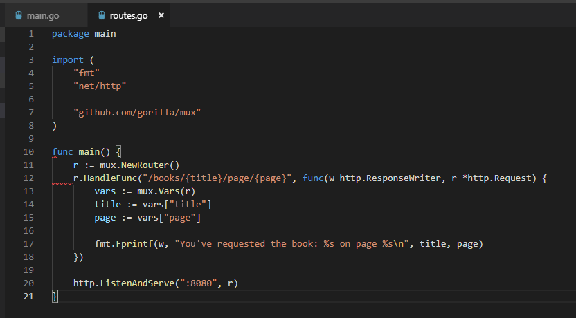

Pada contoh diatas dapat kita lihat bahwa:
1. Package yang kita import adalah ``fsm``, ``net/http`` dan ``github.com/gorilla/mux`` yang mengarah pada folder ../github.com/gorilla/mux.
2. Selanjutnya kita tambahkan pada main fungsi sebuah Routing baru. Router ini adalah router utama untuk aplikasi web kita yang nantinya akan diteruskan sebagai parameter ke server. Router akan menerima semua koneksi HTTP dan meneruskannya ke penangan permintaan yang akan kita daftarkan. Kita dapat membuat router baru dengan script ``r: = mux.NewRouter()``.
3. Selanjutnya kita buat handler fungsi dengan ``http.HandleFunc()`` dengan Route alamat ``"/books/{title}/page/{page}"``. ``{title}`` dan ``{page}`` adalah variable yang nantinya dapat diisikan dengan nilai.
4. Selanjutnya kita akan menggunakan fungsi Mux GET. Pada bagian selanjutnya kita gunakan fungsi ``mux.vars(r)`` untuk mengambil http.Request sebagai parameter variable dan mengambil peta segment.
5. Dibagian akhir kita set server http kita pada port 8080. Sehingga untuk mengaksesnya kita akses dengan alamat ``http://localhost:8080/books/{title}/page/{page}``. 

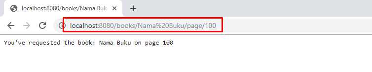

## MEMBUAT TEMPLATE

Dalam Bahasa Go terdapat package ``html/template`` yang digunakan untuk membuat template dalam bahasa HTML. Package ini biasa digunakan dalam aplikasi web untuk menampilkan data dengan cara terstruktur di browser. Manfaat Go template adalah pelolosan data secara otomatis. Tidak perlu khawatir tentang serangan XSS karena Go mem-parsing template HTML dan lolos dari semua input sebelum menampilkannya ke browser.

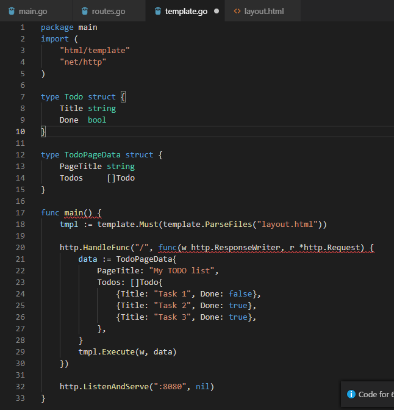

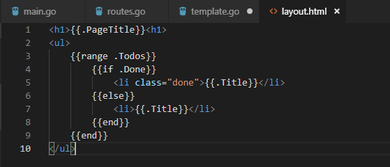

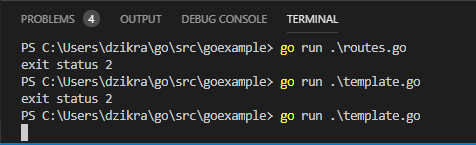

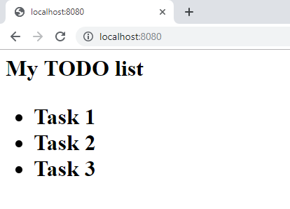
