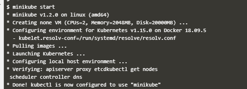
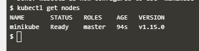
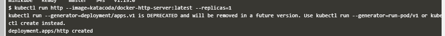
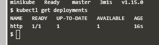
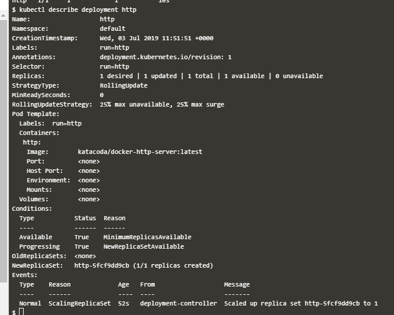
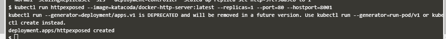
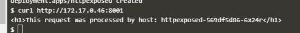
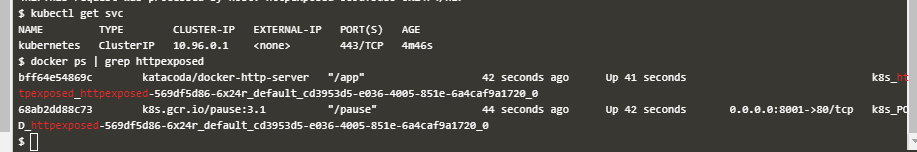
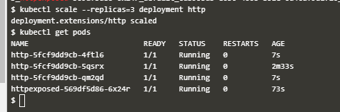

## Minikube
Minikube adalah tool yang memudahkan kita menjalankan Kuberntes secara mudah di local. Kita dapat melakukan konfigurasi pada node yang ada dalam Kubernate. Pada Course ini kita akan belajar memahami tentang minikube dan penggunaannya.

1. Kita jalankan minikube dengan perintah ``minikube star``
   
   

2. Setelah berhasil kita jalankan, kita dapat cek apakah minikube telah siap dengan perintah ``kubectl get nodes``. disana kita dapat lihat bahwa minikube telah siap digunakan.
   
   

3. Selanjutnya kita dapat men-deploy image yang kita inginkan. kita juga dapat membuat replica atas image yang kita jalankan tersebut. Pada praktik ini kita coba menjalankan image ``docker-http-server`` tag ``latest``. 
   
   

4. Kita cek apakah deploy image kita berhasil atau tidak dengan perintah ``kubectl get deplooyments``
   
   

   Dapat kita lihat bahwa terdapat deployment image http. Kita juga dapat melihat secara rinciian container tersebut dengan perintah ``kubectl describe deployment http``.

   

5. Selanjutnya kita dapat  mengekspose service tersebut ke sebuah port sehingga dapat diakses oleh container lain bahkan node lain. pada contoh ini kita buka akses ``hostport`` pada port 8001.
   
   

6.  Kita coba akses dengan browser curl pada IP tersebut dan port 8001
   
   

7.  untuk melihat service yang berjalan kita dapat gunakan perintah ``kubectl get svc``. sedangkan untuk melihat detail dari service yang berjalan kita fapat gunakan perintah ``docker ps``.
   
   

8.  Kita juga dapat membuat service dari http menjadi beberapa pods dengan perintah ``scale``. misalkan kita akan membuat node http menjadi 3 buah replika. berarti perintahnya adalah ``kubectl scale --replaces=3 deployment http``.
   
   

   
## DEPLOY CONTAINER DENGAN YAML
