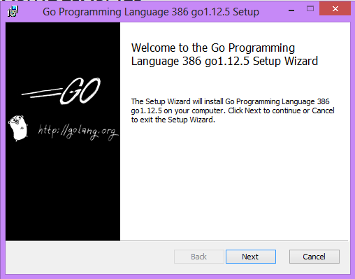
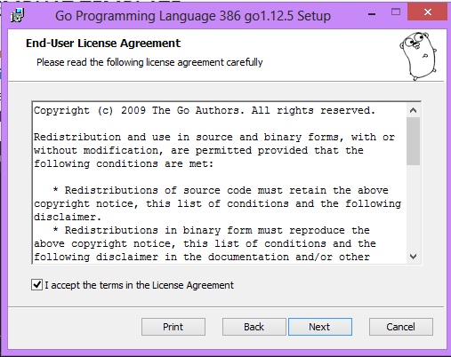
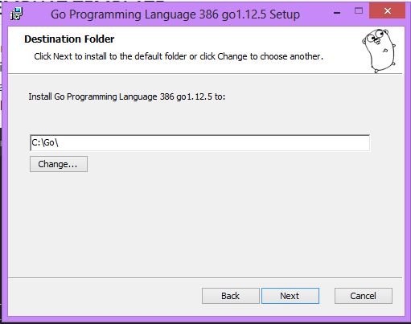
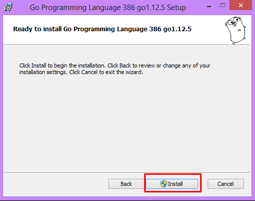
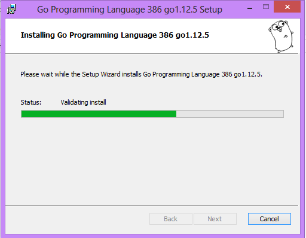
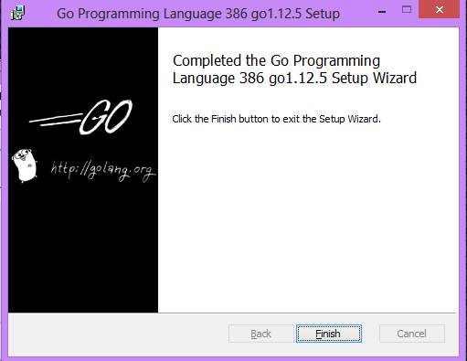
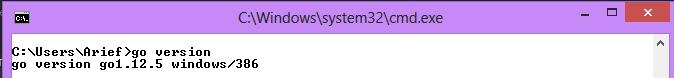
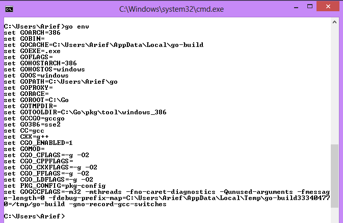

## INSTALL GO (GOLANG) DI WINDOWS

Pada kesempatan ini saya menggunakan golang versi 1.12.5 Windows 32bit. Untuk link Download dapat di download di [Go-Download](https://golang.org/dl/). Selanjutnya kita jalankan file hasil download kita sehingga tahapannya sebagai berikut.

1. Jalankan File yang kita download tadi. Kemudian klik ``Next > ``

2. Selanjutnya kita akan disuguhkan License Agreement untuk go. Kita beri check pada Agreement selanjutnya kita klik ``Next``.

3. Selanjutnya kita pilih Destination tempat menginstall go. Disini kita letakkan di folder ``C:\go\``. Kemudian tekan ``Next``.

4. Golang siap di install. kita klik ``Install``.

5. Tunggu hingga proses install selesai. 

Setelah selesai kita klik ``Finish``

6. Kita cek apakah go yang kita install berhasil atau tidak. Kita buka Command Line (CMD), selanjutnya kita ketikka perintah ``go version`` maka akan menampilkan versi go yang kita install

Untuk melihat setting ``env`` golang, kita ketikkan perintah ``go env``. disini kita dapat melihat setting ``GOPATH`` dimana terletak pada direktori ``C:\Users\arief\go``. ``GOPATH`` digunakan untuk meletakkan project-project yang akan kita buat.

